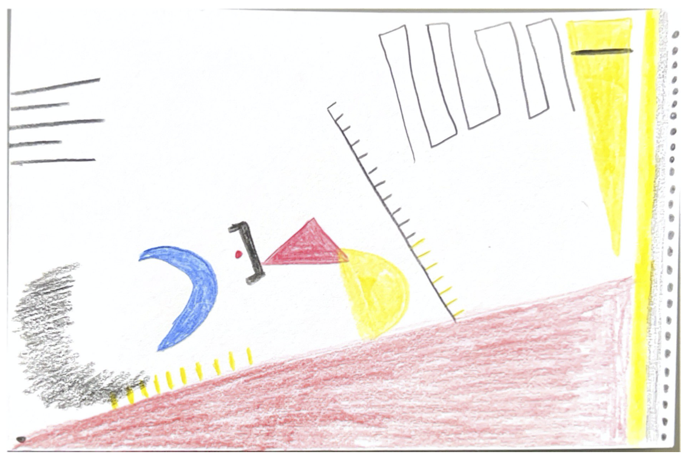

# Irsa Ashraf

I am a second year student pursuing a Masters in Computational Analysis and Public Policy at the University of Chicago. I earned my B.A. in Economics and Global Studies from UCLA in 2018. My interests are in data science and technology policy.